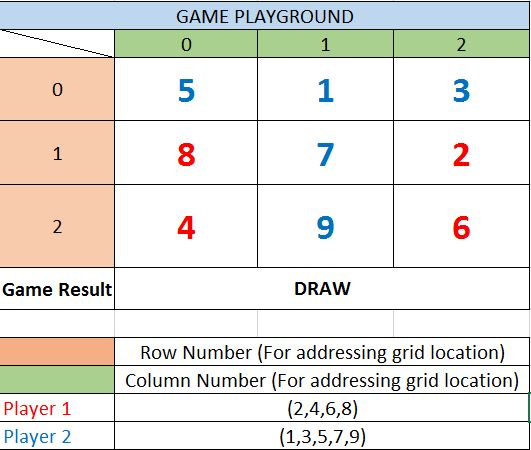

### TicTacToe Numerical Reinforced Learning Game Agent

#### Background
Conventional TicTacToe game involes just 2 kinds of inputs (X or O). However, in an numerical TicTacToe game, we play with numbers.
- The grid looks like a 3X3 matrix.
- One player gets odd numbers (1,3,5,7,9) to play
- Another player gets even numbers (2,4,6,8) to play
- Ever player moves in alternate fashion (one-after-the-other)
- Who ever is able to complete a sum of 15 in any one row/column/major diagonal, WINS the game.
- **IMPORTANT : The odd player always plays first.**

Example:

#### Environment
- We have presented 2 agents here, one who plays EVEN numbers and other who plays ODD numbers
- The environments in these cases are complementary to the agent.
- `Agent-Learning.ipynb` file in each of the directories, has the environment code embedded as `class TicTacToe`
- For playing with the learnt agent, a different Environment file is provided as `TCGame_Env_Game.py` which helps play a `user_input` driven game.

#### Reward Structure
- For **every move** the agent gets a `-1 reward`
- If because of a move, the **Agent wins** (GAME ENDS) he gets a `+10 reward`
- If because of a move, the **Agent lost** (GAME ENDS) it gets a `-10 reward`
- If the (GAME ENDS) as a **Draw**, the agent gets a `0 reward`

#### RL Agent
- RL Agent Learning code has been provided as a separate python notebook
- RL Agent utilizes the concept of Q-Learning, in learning the best action to take based on the current state of the play board.
- Since an agent will take an action based on the moves played after the environment has played, therefore, there are considerably finite `state` that will ever observe.
- Agent maintains an in-memory data structure
 - where in key is the state seen by the agent, 
 - as sub-key, there are possibles moves that the agent can do in such cases. 
 - Each move is thereafter associated with a value, which we call as the Q-Value 

- (Also known as the action value : Synonymous to `q(s,a)` in RL equation. In short`q(s,a)` is the weighted sum of immediate reward and expected future rewards that an agent will gain by taking `action (a)` when in `state (s)`

#### Algorithm (Q Learning - Deterministic States - (without Neural Networks)

Following are the 2 main equations in Reinforcement Learning environment

State Value Function : $V(s) = \pi(a,s)Q_\pi(s,a)$

Action Value Function (q-value) : $Q_\pi(s,a) = P(\hat{s},r | s,a)[ r + \gamma( V(\hat{s}) ) ]$

Combined Equation (based on state value) : $V(s) = \pi(a,s)P(\hat{s},r | s,a)[ r + \gamma( V(\hat{s}) ) ]$

The concept of Q-Learning comes under **Model Free** Reinforcement Learning. With Model Free what is meant is that the model of the environment is not known, precisely 

$P(\hat{s},r | s,a)$ - Probability of moving to state ($\hat{s}$) and getting a reward ($r$) given present ($s$) and ($a$).

The above probabilistic map of environment, is not available in **Model Free** environments.

(To be updated)